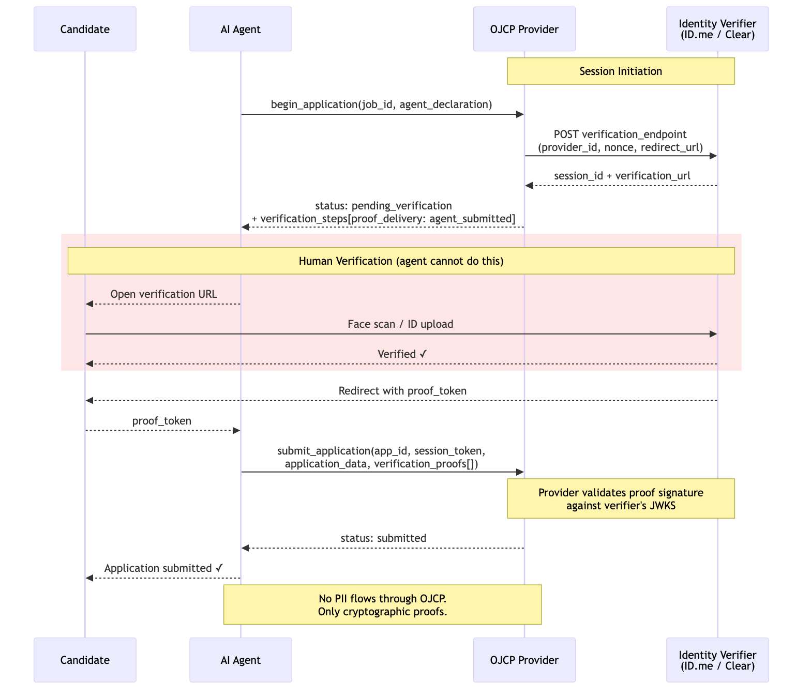
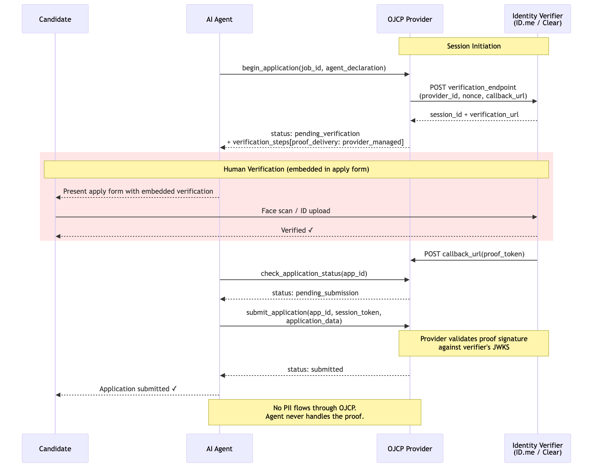

# OJCP — Open Job Context Protocol

**A standard for agent-consumable job feeds.**

[](https://github.com/ojcp-org/ojcp)
[](https://github.com/ojcp-org/ojcp)
[](https://www.apache.org/licenses/LICENSE-2.0)

---

AI agents are beginning to search for jobs, evaluate opportunities, and submit applications on behalf of candidates. The infrastructure they're trying to use — job feeds, careers pages, ATS apply flows — was never designed for them.

**OJCP defines how job opportunities, employer context, and application affordances should be expressed so that AI agents can discover, reason over, and act on them.** It composes with the [Model Context Protocol (MCP)](https://modelcontextprotocol.io), [WebMCP](https://developer.chrome.com/docs/ai/webmcp), and schema.org/JobPosting.

<p align="center">
  
</p>

---

## What's in this repo

```
/spec
  ojcp-v0.1.bs              # Bikeshed spec source (compiles to .html)
/schemas
  manifest.json             # ojcp.json manifest schema
  job-posting.json          # JobPosting JSON schema
  candidate-context.json    # CandidateContext JSON schema
  agent-declaration.json    # AgentDeclaration JSON schema
  eeo-data.json             # EEO data schema (EEOC/OFCCP/GDPR)
  verification-step.json    # VerificationStep schema
  verification-proof.json   # VerificationProof schema
  verifier-manifest.json    # Verifier discovery manifest schema
  tools/                    # Tool input schemas
    search-jobs-input.json
    get-job-detail-input.json
    get-employer-context-input.json
    begin-application-input.json
    submit-application-input.json
    check-application-status-input.json
  responses/                # Tool response schemas
    search-jobs.json
    job-detail.json
    employer-context.json
    begin-application.json
    submit-application.json
    application-status.json
    find-providers.json
    error.json
/examples
  manifest.json             # Example /.well-known/ojcp.json
  job-posting.json          # Example job with apply paths
  verifier-manifest.json    # Example /.well-known/ojcp-verifier.json
  verification-proof.json   # Example proof with decoded JWT claims
  submit-application.json   # Example submit_application tool call
  responses/                # Tool response examples
    search-response.json
    begin-application-verification.json
    submit-application-response.json
    submit-application-validation-failed.json
    submit-application-verification-failed.json
/diagrams
  *.mmd                     # Mermaid diagram sources
/content
  images/                   # Generated diagram PNGs
/docs
  proposal.md               # Original RFC proposal
  decisions/                # Steering committee decision records
GOVERNANCE.md               # Governance charter, steering committee, IP policy
CONTRIBUTING.md             # How to contribute, RFC process, DCO
CODE_OF_CONDUCT.md          # Contributor Covenant
ADOPTERS.md                 # Organizations using or evaluating OJCP
```

---

## Quick Start

### For job boards and employer career sites

Add a manifest at `/.well-known/ojcp.json`:

```json
{
  "ojcp_version": "0.1",
  "provider": {
    "name": "Acme Corp Careers",
    "employer_id": "acme-corp"
  },
  "mcp_endpoint": "https://careers.acme.com/ojcp/mcp",
  "tools": ["search_jobs", "get_job_detail", "get_employer_context", "begin_application", "submit_application", "check_application_status"]
}
```

Then expose the standard OJCP tools via any MCP-compatible transport. See the [full spec](spec/ojcp-v0.1.bs) for tool schemas.

### For browser-native agents (WebMCP)

OJCP supports [WebMCP](https://developer.chrome.com/docs/ai/webmcp) (Chrome 146+) via two complementary APIs.

**Imperative API** — Register OJCP tools directly on your careers page:

```js
if ("modelContext" in navigator) {
  navigator.modelContext.registerTool({
    name: "search_jobs",
    description: "Search open roles at Acme Corp.",
    inputSchema: {
      type: "object",
      properties: {
        query: { type: "string", description: "Search query" },
        location: { type: "string", description: "Location filter" }
      },
      required: ["query"]
    },
    execute: async (params) => {
      const results = await fetchJobs(params);
      return { content: [{ type: "text", text: JSON.stringify(results) }] };
    }
  });
}
```

**Declarative API** — Annotate apply forms so agents can submit applications natively:

```html
<form toolname="begin_application"
      tooldescription="Apply to this role at Acme Corp."
      action="/apply" method="POST">
  <input name="full_name" toolparamdescription="Candidate full name" />
  <input name="email" type="email" toolparamdescription="Contact email" />
  <textarea name="cover_letter" toolparamdescription="Cover letter" />
  <button type="submit">Apply</button>
</form>
```

See [Section 6 of the spec](spec/ojcp-v0.1.bs) for the full WebMCP integration guide.

### For agent developers

Query the OJCP Registry to discover compliant providers:

```
GET https://registry.ojcp.dev/.well-known/ojcp.json
```

Then call `find_ojcp_providers` as an MCP tool to locate relevant job context providers by industry, employer, or location.

---

## Core Concepts

**Job Manifest** — Every OJCP provider exposes `/.well-known/ojcp.json` declaring their tools, endpoints, and apply paths. Agents and browsers probe this to discover capabilities without navigating the full site.

**Job Tools** — MCP-compatible callable functions: `search_jobs`, `get_job_detail`, `get_employer_context`, `begin_application`, `submit_application`, `check_application_status`. Any MCP client can call them directly.

**Apply Paths** — A normalized taxonomy of how candidates can apply (`ats_direct`, `provider_hosted`, `platform_native`, `email`, `external_redirect`, `custom`), each declaring whether it `supports_agent_submission`.


**Candidate Context** — A minimal, consent-scoped candidate profile passed by agents for personalized search and fit scoring. PII-minimized by design.

**Agent Declaration** — Agents identify themselves on every application initiation. Enables employer audit trails, rate limiting, and abuse prevention.

**Identity Verification** — For roles that require verified human identity (finance, government, healthcare), OJCP integrates with third-party verifiers like ID.me and Clear. Two delivery models are supported: **provider-managed** (verification embedded in the apply form, proof delivered directly to the provider via callback) and **agent-submitted** (agent collects the proof and includes it in `submit_application`). In both cases, candidates complete a face scan or ID upload, and a cryptographic proof is validated — no PII flows through the protocol.

**Agent-Submitted Verification** — agent collects the proof and submits it:



**Provider-Managed Verification** — proof delivered directly to the provider (e.g., Clear embedded in a provider-hosted apply flow):



### How it works

<p align="center">
  
</p>

An agent discovers a provider, searches for jobs, and initiates an application — all through standard MCP tool calls:


When the agent applies on behalf of a candidate, OJCP enforces a consent gate before submission:


---

## Interoperability

| Standard | Relationship |
|---|---|
| MCP | OJCP tools are valid MCP tools — callable by any MCP client |
| WebMCP | Imperative API (`navigator.modelContext.registerTool()`) and declarative API (form `toolname`/`tooldescription` attributes) |
| schema.org/JobPosting | OJCP extends it; existing structured data stays valid |
| OpenAPI 3.1 | REST endpoints documented in OpenAPI; registry validates conformance |
| Indeed / Zip XML Feeds | OJCP layers over existing feeds via adapter; no replacement required |

---

## Status

This is **Draft v0.1**. The spec is open for community feedback before stabilization.

| Phase | Milestone | Target |
|---|---|---|
| **0.1** | Draft spec + Recruitics reference implementation | Q1 2026 |
| **0.2** | First external partner integration | Q2 2026 |
| **0.3** | Registry MVP + browser agent pilot | Q3 2026 |
| **1.0** | Stable spec; 10+ verified providers | Q4 2026 |

---

## Contributing

We are actively seeking co-contributors from:

- **Job boards & aggregators** — Indeed, Zip, LinkedIn, Greenhouse, Lever, Workday, iCIMS, SmartRecruiters
- **Agent platform developers** — browser vendors, AI assistant teams, recruiting AI startups
- **Enterprise employers** — high-volume hiring orgs who want their ATS reachable by candidate agents

See [CONTRIBUTING.md](CONTRIBUTING.md) for the RFC process and how to propose changes.

Discuss: `ojcp-discuss@recruitics.com`

---

## Author

**Austin Anderson** — CTO, Recruitics

OJCP is proposed as an open standard. See [GOVERNANCE.md](GOVERNANCE.md) for the steering model and Recruitics' role.

---

## License

[Apache License 2.0](https://www.apache.org/licenses/LICENSE-2.0)