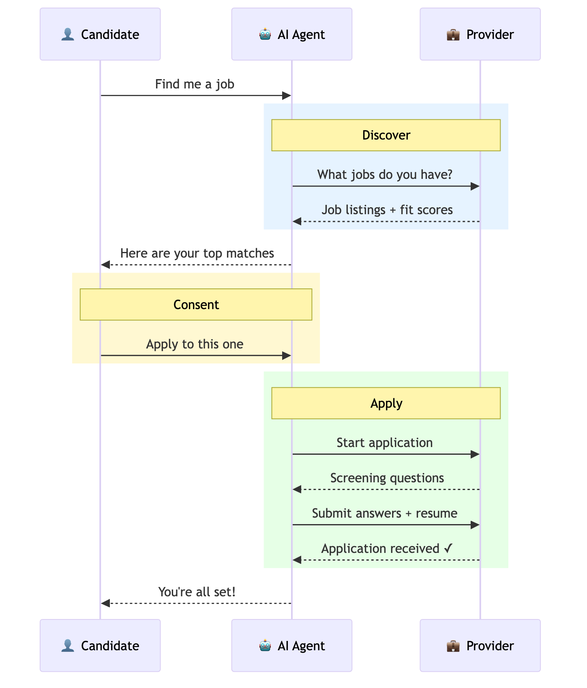
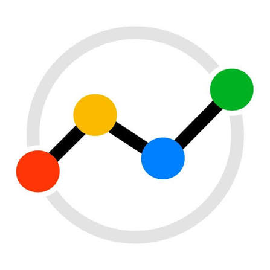
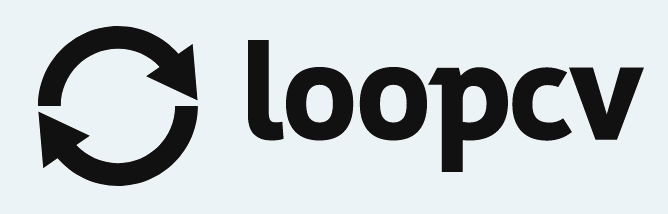
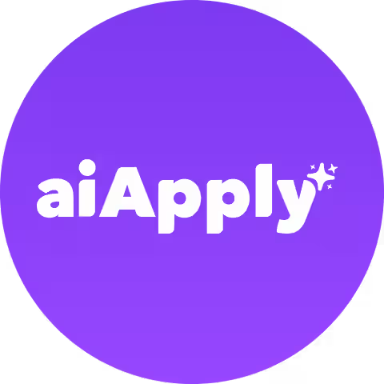
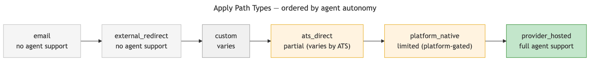
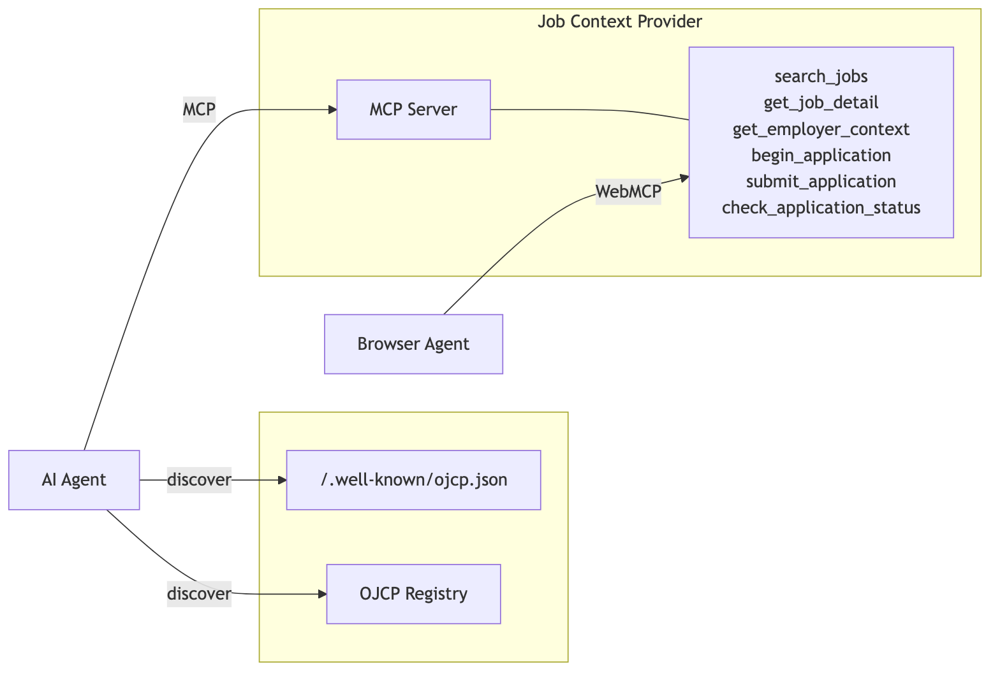
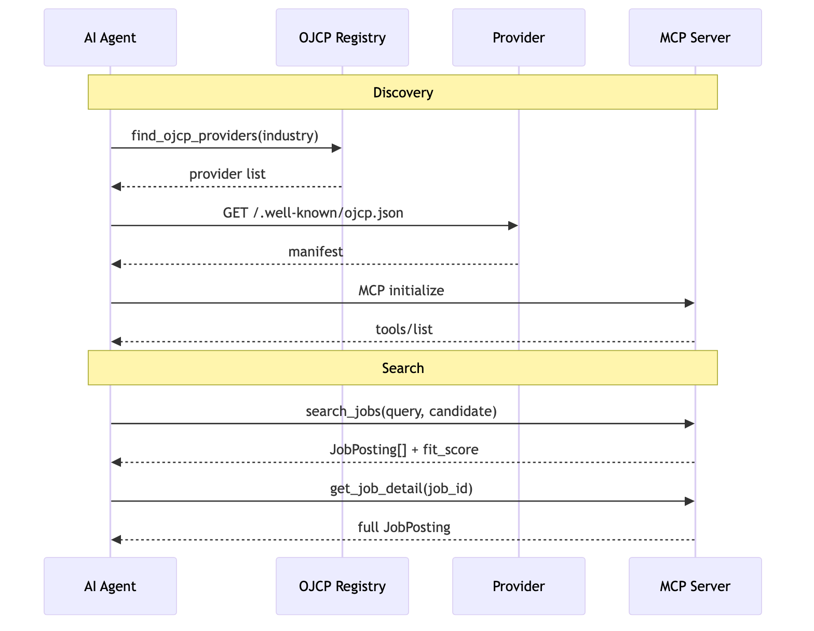
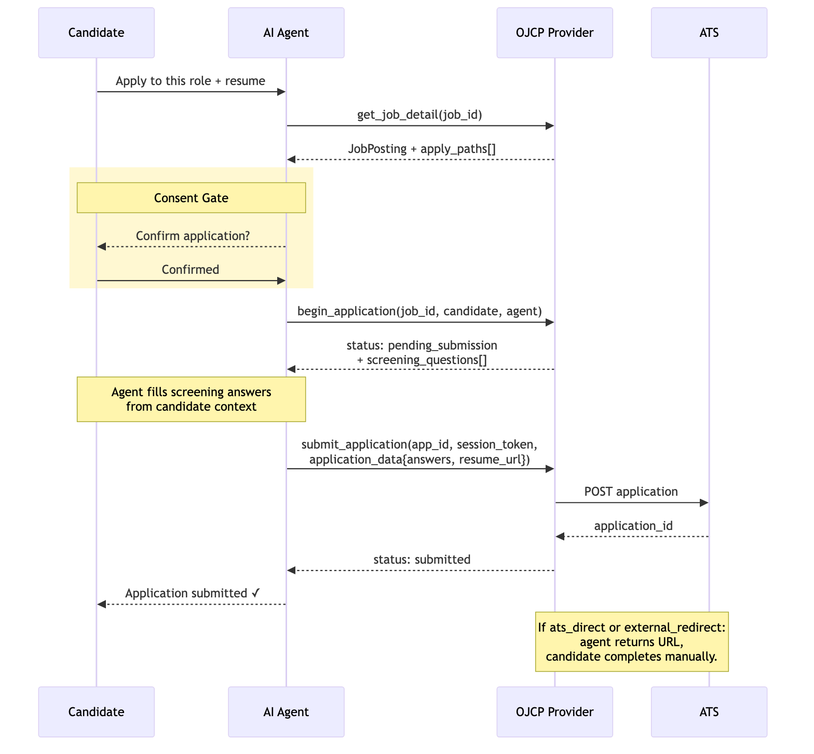

# OJCP — Open Job Context Protocol

**An open standard for agent-consumable job data, built on MCP.**

[](https://spec.ojcp.dev/)
[](https://spec.ojcp.dev/)
[](LICENSE)
[](CONTRIBUTING.md#licensing)

---

AI agents are beginning to search for jobs, evaluate opportunities, and submit applications on behalf of candidates. The infrastructure they're trying to use — job feeds, careers pages, ATS apply flows — was never designed for them.

**OJCP defines how job opportunities, employer context, and application affordances are expressed so that AI agents can discover, reason over, and act on them.** It composes with the [Model Context Protocol (MCP)](https://modelcontextprotocol.io), [WebMCP](https://developer.chrome.com/docs/ai/webmcp), and schema.org/JobPosting.

- 📖 **Spec:** [spec.ojcp.dev](https://spec.ojcp.dev/)
- 🌐 **Site:** [ojcp.dev](https://ojcp.dev)
- ✅ **Conformance suite:** [ojcp-org/conformance](https://github.com/ojcp-org/conformance)
- 🗂️ **Provider registry:** [ojcp-org/registry](https://github.com/ojcp-org/registry)

<p align="center">
  
</p>

---

## Governed by a founding steering committee

OJCP is a community standard, not a single-vendor project. It is governed by a **nine-seat founding steering committee** whose members share equal authority over the protocol's direction. Seats are held by people across the ecosystem — ATS vendors, job boards, auto-apply tools, agent platforms, and staffing — so that no single party can steer the spec to its own advantage.

<p align="center">
  <a href="https://www.workday.com"></a>
  <a href="https://www.crosscountryhealthcare.com"></a>
  <a href="https://www.recruitics.com"></a>
  <a href="https://loopcv.pro"></a>
  <a href="https://hiring.cafe"></a>
  <a href="https://aiapply.co"></a>
  <a href="https://scale.jobs"></a>
  <a href="https://gettink.ai"></a>
</p>

<p align="center">
  <em>Workday · CrossCountry Healthcare · Recruitics · LoopCV · Hiring.cafe · aiApply · scale.jobs · Tink</em>,
  with an invited-expert seat held by Andrew Nolan (WebMCP co-creator).
</p>

See [GOVERNANCE.md](GOVERNANCE.md) for the seat table, term rules, and the RFC decision process, and [ADOPTERS.md](ADOPTERS.md) for organizations building on OJCP.

---

## The OJCP project

| Repo | What it is |
|---|---|
| **[ojcp](https://github.com/ojcp-org/ojcp)** (this repo) | The specification, JSON Schemas, examples, diagrams, and governance |
| **[conformance](https://github.com/ojcp-org/conformance)** | Test suite that validates a provider implementation against the published schemas |
| **[registry](https://github.com/ojcp-org/registry)** | The provider registry — one reviewed JSON entry per provider, added by PR |

---

## What's in this repo

```
/spec
  ojcp-v0.1.bs              # Bikeshed spec source (compiles to spec.ojcp.dev)
/schemas
  README.md                 # $id convention + how to validate offline
  manifest.json             # ojcp.json manifest schema
  job-posting.json          # JobPosting JSON schema
  candidate-context.json    # CandidateContext JSON schema
  agent-declaration.json    # AgentDeclaration JSON schema
  eeo-data.json             # EEO data schema (EEOC/OFCCP/GDPR)
  verification-step.json    # VerificationStep schema
  verification-proof.json   # VerificationProof schema
  verifier-manifest.json    # Verifier discovery manifest schema
  tools/                    # Tool input schemas
  responses/                # Tool response schemas
/examples                   # Worked manifests, job postings, tool responses,
                            #   and a signed agent request (agent-signed-request.http)
/diagrams                   # Mermaid diagram sources (*.mmd)
/content
  images/                   # Rendered diagram PNGs
  logos/members/            # Steering-member logos
/docs
  proposal.md               # Original proposal
  rfcs/                     # Change proposals (RFC 0001 agent identity, …)
  decisions/                # Architecture Decision Records (ADRs)
GOVERNANCE.md               # Governance charter, steering committee, IP policy
CONTRIBUTING.md             # How to contribute, RFC process, DCO, licensing
CODE_OF_CONDUCT.md          # Contributor Covenant
ADOPTERS.md                 # Organizations using or evaluating OJCP
CHANGELOG.md                # Notable spec + governance changes
```

---

## Quick Start

### For job boards and employer career sites

Add a manifest at `/.well-known/ojcp.json`:

```json
{
  "ojcp_version": "0.1",
  "provider": {
    "name": "Acme Corp Careers",
    "employer_id": "acme-corp"
  },
  "mcp_endpoint": "https://careers.acme.com/ojcp/mcp",
  "tools": ["search_jobs", "get_job_detail", "get_employer_context", "begin_application", "submit_application", "check_application_status"]
}
```

Then expose the standard OJCP tools via any MCP-compatible transport, and check your implementation against the [conformance suite](https://github.com/ojcp-org/conformance). See the [full spec](https://spec.ojcp.dev/) for tool and data schemas.

### For browser-native agents (WebMCP)

OJCP supports [WebMCP](https://developer.chrome.com/docs/ai/webmcp) via two complementary APIs.

**Imperative API** — register OJCP tools directly on your careers page:

```js
if ("modelContext" in document) {
  document.modelContext.registerTool({
    name: "search_jobs",
    description: "Search open roles at Acme Corp.",
    inputSchema: {
      type: "object",
      properties: {
        query: { type: "string", description: "Search query" },
        location: { type: "string", description: "Location filter" }
      },
      required: ["query"]
    },
    execute: async (params) => {
      const results = await fetchJobs(params);
      return { content: [{ type: "text", text: JSON.stringify(results) }] };
    }
  });
}
```

**Declarative API** — annotate apply forms so agents can submit applications natively:

```html
<form toolname="begin_application"
      tooldescription="Apply to this role at Acme Corp."
      action="/apply" method="POST">
  <input name="full_name" toolparamdescription="Candidate full name" />
  <input name="email" type="email" toolparamdescription="Contact email" />
  <textarea name="cover_letter" toolparamdescription="Cover letter" />
  <button type="submit">Apply</button>
</form>
```

See the WebMCP integration section of the [spec](https://spec.ojcp.dev/) for the full guide.

### For agent developers

Discover providers from the [registry](https://github.com/ojcp-org/registry) — a Git-backed directory with one reviewed JSON entry per provider. Each entry points at a provider's `/.well-known/ojcp.json`; from there, probe the manifest and call the standard OJCP tools over MCP. To be listed, open a PR adding your entry (domain control is proven per the registry README).

---

## Core Concepts

**Job Manifest** — Every OJCP provider exposes `/.well-known/ojcp.json` declaring its tools, endpoints, apply paths, and (optionally) which requests require a verified agent identity. Agents and browsers probe this to discover capabilities without navigating the full site.

**Job Tools** — MCP-compatible callable functions: `search_jobs`, `get_job_detail`, `get_employer_context`, `begin_application`, `submit_application`, `check_application_status`. Any MCP client can call them directly.

**Apply Paths** — A normalized taxonomy of how candidates can apply (`ats_direct`, `provider_hosted`, `platform_native`, `email`, `external_redirect`, `custom`), each declaring whether it `supports_agent_submission`.



**Candidate Context** — A minimal, consent-scoped candidate profile passed by agents for personalized search and fit scoring. PII-minimized by design.

**Agent Identity** *(RFC 0001, accepted)* — Agents can prove who they are with verifiable request signatures, so providers can distinguish a real, accountable agent from an anonymous scraper without gatekeeping through a central authority. OJCP uses [RFC 9421 HTTP Message Signatures](https://www.rfc-editor.org/rfc/rfc9421) on the [Web Bot Auth](https://developer.chrome.com/docs/ai/web-bot-auth) wire profile: the agent publishes its keys at a signatures directory, signs each request (Ed25519 recommended) and names its key via the `Signature-Agent` header. Providers declare support and which contexts require it under `auth.agent_signatures` in their manifest. A verified identity is a *hint about the agent*, not proof a human authorized the action — for that, an `agent_declaration` can carry an optional user-rooted `user_mandate`. See the Agent Identity section of the [spec](https://spec.ojcp.dev/) and [RFC 0001](docs/rfcs/0001-agent-identity-http-message-signatures.md).

**Agent Declaration** — Agents identify themselves and who they act for on every application initiation. Enables employer audit trails, rate limiting, and abuse prevention.

**Identity Verification** — For roles that require verified human identity (finance, government, healthcare), OJCP integrates with third-party verifiers like ID.me and Clear. Two delivery models are supported: **provider-managed** (verification embedded in the apply form, proof delivered directly to the provider via callback) and **agent-submitted** (agent collects the proof and includes it in `submit_application`). In both cases a cryptographic proof is validated — no raw PII flows through the protocol.

### How it works

<p align="center">
  
</p>

An agent discovers a provider, searches for jobs, and initiates an application — all through standard MCP tool calls:



When the agent applies on behalf of a candidate, OJCP enforces a consent gate before submission:



---

## Interoperability

| Standard | Relationship |
|---|---|
| MCP | OJCP tools are valid MCP tools — callable by any MCP client |
| WebMCP | Imperative API (`document.modelContext.registerTool()`) and declarative form annotations |
| RFC 9421 / Web Bot Auth | HTTP Message Signatures provide verifiable agent identity (see Agent Identity) |
| schema.org/JobPosting | OJCP extends it; existing structured data stays valid |
| Indeed / Zip XML Feeds | OJCP layers over existing feeds via adapter; no replacement required |

---

## Project status

**Draft v0.1 — a living draft.** Accepted RFCs land in 0.1; a versioned release will be cut once a batch of changes is ready to migrate to together. Track changes in [CHANGELOG.md](CHANGELOG.md).

Shipped:

- ✅ v0.1 draft specification and JSON Schemas, published at [spec.ojcp.dev](https://spec.ojcp.dev/)
- ✅ Reference provider live at [ojcp.dev](https://ojcp.dev)
- ✅ Nine-seat founding steering committee seated ([GOVERNANCE.md](GOVERNANCE.md))
- ✅ **RFC 0001** — verifiable agent identity via RFC 9421 — accepted and specified
- ✅ Conformance suite ([ojcp-org/conformance](https://github.com/ojcp-org/conformance)) and provider registry ([ojcp-org/registry](https://github.com/ojcp-org/registry))
- ✅ First independent provider (FoundRole) live and listed in [ADOPTERS.md](ADOPTERS.md)

In progress:

- 🚧 RFC 0002 (`official_job_url`) and RFC 0003 (action-bound user mandates) in the RFC pipeline
- 🔜 Growing the registry and adopter set; a consent/authorization RFC to finalize the `user_mandate` claim set

---

## Contributing

OJCP is built in the open, and external contributions are already shaping it — the RFCs and providers above came from the community. We especially welcome:

- **Job boards, aggregators & ATS vendors** who want their inventory reachable by candidate agents
- **Agent & browser platform developers** building the candidate-side experience
- **Employers** with high-volume hiring who want their apply flows agent-ready

Start with [CONTRIBUTING.md](CONTRIBUTING.md) for the RFC process, DCO sign-off, and licensing. Propose changes as an [RFC](docs/rfcs/), validate implementations with the [conformance suite](https://github.com/ojcp-org/conformance), and add yourself to [ADOPTERS.md](ADOPTERS.md).

Discuss: [GitHub Discussions](https://github.com/ojcp-org/ojcp/discussions) · `ojcp-discuss@recruitics.com`

---

## License

Dual-licensed by content type (see [CONTRIBUTING.md](CONTRIBUTING.md#licensing)):

- **Specification, schemas, examples, docs** — [CC BY 4.0](https://creativecommons.org/licenses/by/4.0/)
- **Code, tooling, CI** — [Apache License 2.0](LICENSE)

OJCP was authored by **Austin Anderson** (CTO, Recruitics) and is now governed by its [steering committee](GOVERNANCE.md).
